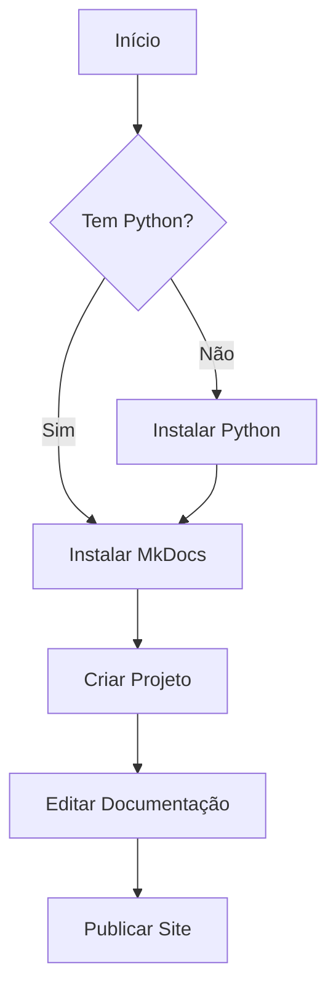

# 🚀 Bem-vindo ao Meu Projeto

Olá! Esta é a documentação do meu projeto de exemplo usando **MkDocs**. 

## 📖 Sobre este Projeto

Este é um exemplo de como criar uma documentação bonita e funcional usando MkDocs com o tema Material Design.

!!! info "Informação"
    Esta documentação foi criada para demonstrar as principais funcionalidades do MkDocs.

## 🎯 Principais Funcionalidades

### ✨ Recursos Disponíveis

- **📝 Documentação** clara e organizada
- **🎨 Tema moderno** com Material Design
- **🔍 Busca** integrada
- **📱 Responsivo** para mobile
- **🌙 Modo escuro** alternável

### 🛠️ Tecnologias Utilizadas

| Tecnologia | Versão | Propósito |
|------------|--------|-----------|
| MkDocs | 1.5+ | Gerador de sites |
| Material | 9.0+ | Tema visual |
| Python | 3.8+ | Runtime |

## 🚀 Início Rápido

### Pré-requisitos

- Python 3.8 ou superior
- pip (gerenciador de pacotes)

### Instalação

```bash
# Instalar MkDocs
pip install mkdocs-material

# Criar novo projeto
python -m mkdocs new meu-projeto

# Entrar na pasta
cd meu-projeto

# Servir localmente
python -m mkdocs serve
```

### Primeiro Uso

1. **Edite** o arquivo `mkdocs.yml`
2. **Crie** arquivos `.md` na pasta `docs/`
3. **Execute** `python -m mkdocs serve`
4. **Acesse** http://localhost:8000

## 📊 Exemplo de Diagrama



## 💡 Dicas Úteis

!!! tip "Dica"
    Use `python -m mkdocs serve` para visualizar mudanças em tempo real!

!!! warning "Atenção"
    Sempre teste sua documentação localmente antes de fazer deploy.

!!! success "Sucesso"
    Parabéns! Você criou sua primeira documentação com MkDocs.

## 🔗 Links Úteis

- [Documentação Oficial](https://mkdocs.org)
- [Material Theme](https://squidfunk.github.io/mkdocs-material/)
- [Markdown Guide](https://www.markdownguide.org)

## 📞 Contato

- **📧 Email**: seu.email@exemplo.com
- **🐙 GitHub**: [github.com/seuusuario](https://github.com/seuusuario)
- **💼 LinkedIn**: [linkedin.com/in/seuperfil](https://linkedin.com/in/seuperfil)

---

*📝 Documentação criada com ❤️ usando MkDocs*
